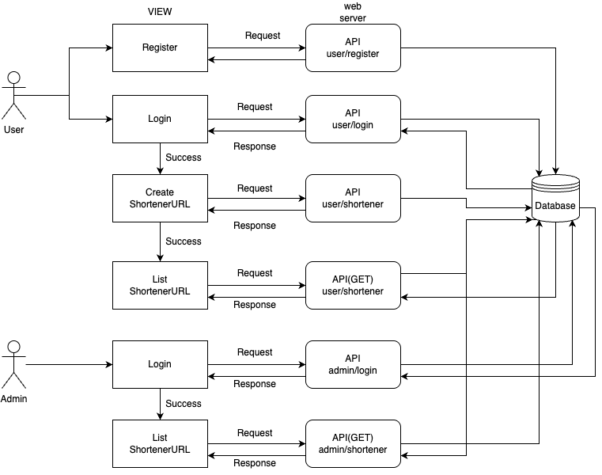

# shortener-url-laravel

A simple URL shortener application built with Laravel.  
This project allows users to shorten long URLs into shorter, easy-to-share links.

## Features

- Create short URLs
- Redirect short URLs to original URLs
- User-friendly interface
- Lightweight and efficient

## Requirements

- PHP >= 8.0
- Laravel 12.x
- Composer
- Node.js
- React
- MySQL

## Installation

Follow these steps to set up the project:

1. Clone the repository:
   ```bash
   git clone https://github.com/panudev/shortener-url-laravel.git
   ```

2. Navigate into the project directory:
   ```bash
   cd shortener-url-laravel
   ```

3. Install project dependencies:
   ```bash
   composer install
   ```

4. Copy the `.env.example` file and create a new `.env` file:
   ```bash
   cp .env.example .env
   ```

5. Generate the application key:
   ```bash
   php artisan key:generate
   ```

6. Configure your database settings in the `.env` file.

7. Run the database migrations:
   ```bash
   php artisan migrate
   ```

8. Start the development server:
   ```bash
   php artisan serve
   ```

Once running, you can access the application at:
```
http://localhost:8000
```

## System Architecture

Insert your system architecture diagram here:



## Project Structure

- **Routes**: Defined in `routes/web.php`
- **Controllers**: Handle URL logic in `app/Http/Controllers`
- **Models**: Manage database interaction
- **Views**: Blade templates located in `resources/js/pages`
- **Migrations**: Database table structures in `database/migrations`

## Usage

- Enter a long URL into the provided form.
- The system will generate a shortened URL.
- Accessing the shortened URL will redirect users to the original URL.

